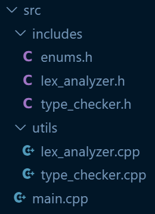
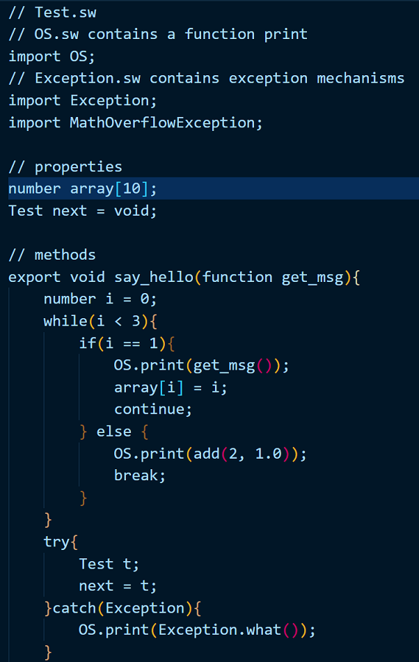
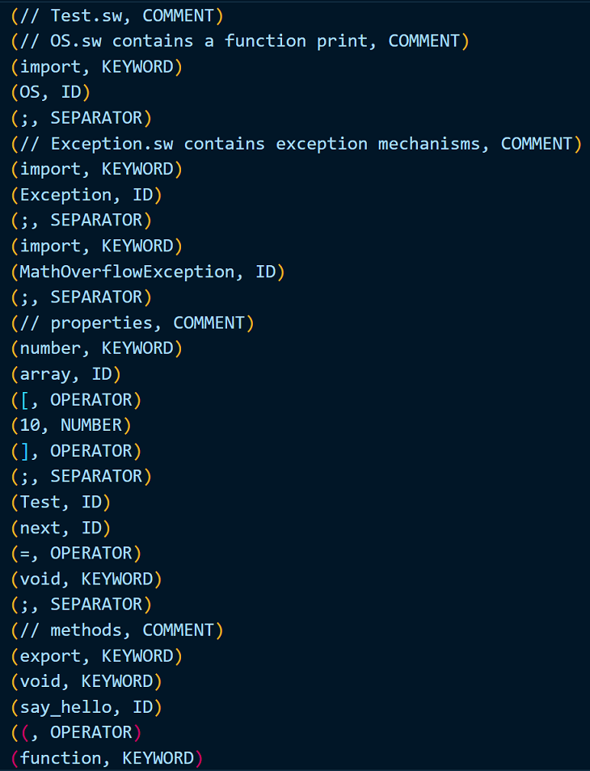
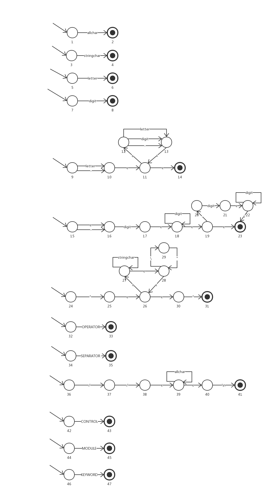
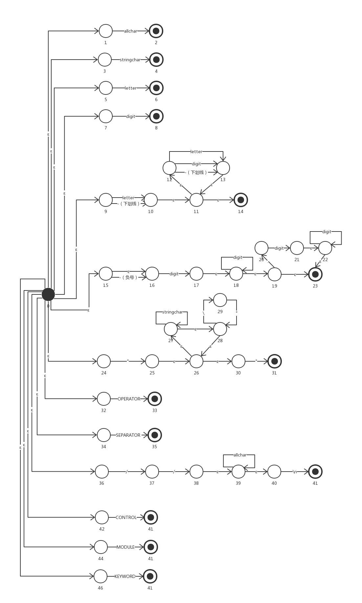
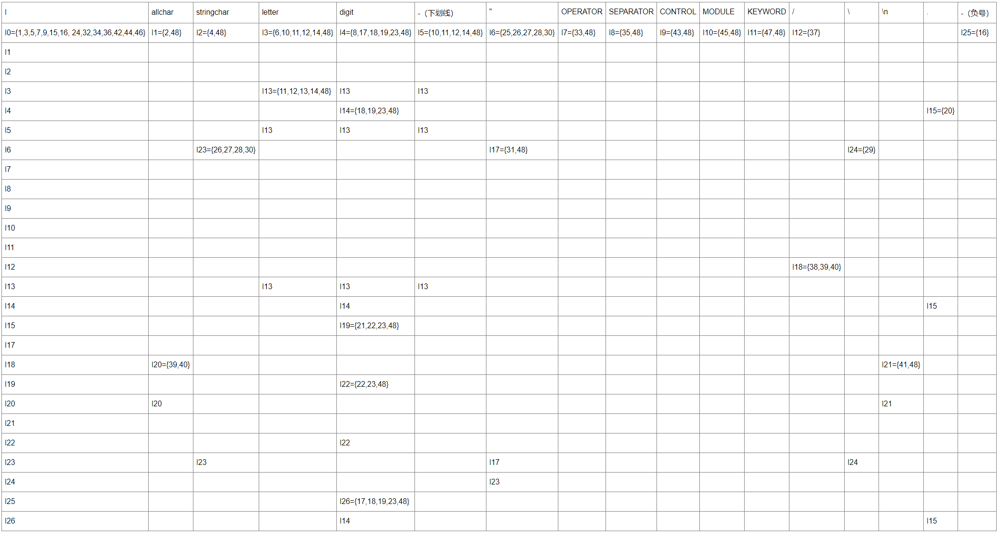
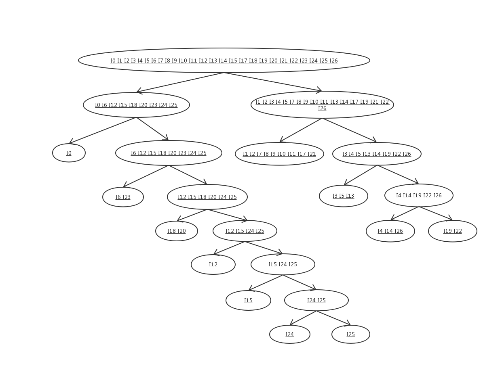
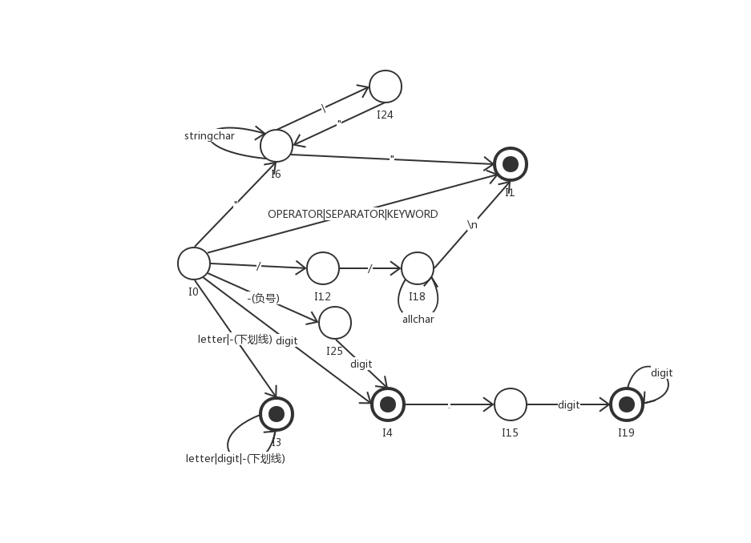

## Lex实验报告

学号：171250662

姓名：孙逸伦

### 0. 简介

基于FA的实现，所以没有lex文件。

#### 0.1. 源文件目录截图



#### 0.2. 输入文件/流内容截图

输入文件较长，可以参见**1.3. 语言示例**。以下是部分内容截图：



#### 0.3. 输出token截图

输出token较长，可以参见项目根目录下`Test_out_lex.txt`文件内容。以下是部分内容截图：



#### 0.4. 运行方法

在项目`src/`目录下，执行如下语句：

```c++
g++ main.cpp utils/type_checker.cpp utils/lex_analyzer.cpp -o main
./main
```

### 1. 词法和语法定义

临时起意设计了一门新语言，姑且称之为Simple Words。

#### 1.1. 设计理念

尽可能简单的同时支持模块化。这门语言应当同时支持面向过程和基于对象（通过模块）。

函数是一等公民。

这门语言不包含指针和位运算。我认为位运算的可读性较差，使用内置的函数代替。默认基本类型传值，模块传引用；提供深拷贝的内置函数。

在实践中我发现，容易出现过大的单个模块，导致可读性和可维护性下降，所以从语言层面进行限制，强制要求每个文件整体作为一个模块。

不强制要求main函数，从当前文件开始执行，由使用者自行决定调用顺序。

#### 1.2. 词法和语法

语言的关键字应该包括：控制结构（顺序、循环、分支）、基本类型、操作符、分隔符。

标识符由用户自定义，由字母、数字和下划线组成，以字母或下划线开头，且不能与关键字冲突。

所以，我们需要的控制结构关键字：if | else | while | break | continue | return。

布尔运算可以转换成等价的if-else语句，故并不打算提供语言机制来实现布尔运算。但可以内置函数来封装布尔运算逻辑。

为了语言的健壮性，需要支持异常机制。所以我们需要的关键字：try、catch、throw。throws就不作为关键字了。

为了支持模块化，我们需要的关键字：import | export。默认访问权限是模块内的，可以通过export对外暴露接口。可以通过.获取模块里export的内容；本来打算用`->`的，但感觉上`.`更符合使用习惯，而且更简单，更符合设计初衷。

没有继承机制，通过对象间的委托进行交互。从某种意义上来说，这个语言是默认单例的。

因为并没有类这个概念，没有实例化，也就不需要构造函数。

语言的基本类型：数字、字符串、函数、∅（包括未定义undefined和空值null，都可以用∅来概括；布尔值可以看作0和非0）。其中，基本类型应该包括字面量。所以，我们需要的类型有：number | string | function | void。其中，number应该包括负数和浮点数，但不打算使用科学计数法；字符串由""包裹，如果字符串中出现"，需要进行转义。函数的类型自动推导。

操作符应该包括：算术运算符、比较运算符、取值运算符、转义运算符

所以，我们需要的关键字：operator -> + | - | * | / | ( | ) | < | > | <= | >= | == | != | = | [ | ] | . | \

分隔符应该包括：separator ->, | ; | { | }。

只支持单行注释//，因为个人不太喜欢多行注释，并且在实践中感觉多行注释也没有那么大的作用。同时，字符串的优先级高于注释，也就是说，"//comment"会被视作一个完整的字符串，而不是一个未封闭的引号和一个单行注释。

\n \r \f \t和空格算作空白符，除此之外的不可打印字符都不算。

#### 1.3. 语言示例

基本包含了语言的特性。

```typescript
// Test.sw
// OS.sw contains a function print
import OS;
// Exception.sw contains exception mechanisms
import Exception;
import MathOverflowException;

// properties
number array[10];
Test next = void;

// methods
export void say_hello(function get_msg){
    number i = 0;
    while(i < 3){
        if(i == 1){
            OS.print(get_msg());
            array[i] = i;
            continue;
        } else {
            OS.print(add(2, 1.0));
            break;
        }
    }
    try{
        Test t;
    	next = t;
    }catch(Exception){
        OS.print(Exception.what());
    }
}

number add(number a, number b) throw MathOverflowException{
    if(a + b < MIN_NUMBER){
        throw MathOverflowException;
    }
    return a + b;
}

string get_msg(){
    return "Hello World!";
}
```

### 2. 步骤简介

基于FA的解决方案（硬编码）

1. 预先定义正规表达式REs
2. 采用自顶向下的方法将REs转化成NFAs
3. 合并为一个单独的NFA
4. 转换成DFA
5. 化简为DFAo
6. 基于DFAo编写程序

### 3. 具体实现

#### 3.1. 预先定义正规表达式REs

```
// 即键盘上出现的可打印的字符，(space)表示空格。暂不考虑其他字符。
allchar -> stringchar | "

// 即allchar中去掉"（双引号）。
stringchar -> letter| digit | ! | @ | # | $ | % | ^ | & | * | ( | ) | _ | + | - | = | ` | ~ | { | } | [ | ] | : | ; | ' | , | . | < | > | ? | / | \ | \\| | (space)

letter -> A | B | C | D | E | F | G | H | I | J | K | L | M | N | O | P | Q | R | S | T | U | V | W | X | Y | Z | a | b | c | d | e | f | g | h | i | j | k | l | m | n | o | p | q | r | s | t | u | v | w | x | y | z

digit -> 0 | 1 | 2 | 3 | 4 | 5 | 6 | 7 | 8 | 9

ID -> (letter | _) (letter | digit | _)* 

NUMBER -> (- | ε)digit digit* (.digit digit* | ε)

STRING -> "((stringchar)*(\")*)*"

OPERATOR -> + | - | * | / | ( | ) | < | > | <= | >= | == | != | = | [ | ] | -> | \

SEPARATOR -> , | ; | { | }

CONTROL -> if | else | while | break | continue | return

COMMENT -> // allchar* \n

MODULE -> import | export

KEYWORD -> number | string | function | void | try | catch | throw | CONTROL | MODULE
```

#### 3.2. 采用自顶向下的方法将REs转化成NFAs



#### 3.3. 合并为一个单独的NFA



#### 3.4. 转换成DFA

##### 3.4.1. 转换表



可以看出这张表相当稀疏。

#### 3.5. 化简为DFAo

##### 3.5.1. 等价类划分



##### 3.5.2. 构造DFAo



#### 3.6. 基于DFAo编写程序

参见附件和截图，在此不再赘述。

### 4. 错误处理

识别不合法的字符，并且提示相应的行号。只提示存在错误的第一行。

实现方式是，FA循环结束时进行判断，如果结束时的状态不是I0，则认为出现错误。在循环中，如果遇到无法识别的字符，则跳出循环。同时，每次读到`\n`时行号 + 1，因为在Linux和Windows环境下的换行符都包括`\n`。不考虑换行是`\r`的情况，因为我没有Mac。

实现参见`src/utils/lex_analyzer.cpp`。

### 5. 遇到的问题

1. NFAs数量相当大，化简起来**非常**耗时。

2. “越早发现和修复问题，成本越低”，在转化DFAo时发现错误可能意味着从NFA到分类都要进行修改，不啻于推倒重来。因为中途发现I16出现了错误，为了避免出现更大的错误，直接采用了类似于数据库对自增键的删除方案，删除后在最后一个序号的基础上增加，所以DFA中没有I16。
3. 不同的操作系统对字符的处理方式不同，程序很难做到健壮。
4. 发现了MinGW GCC的一个bug，浪费了一晚上。这也是我第一次遇到编译器自身的bug。

### 6. 个人感受

1. 自己设计的语言估计会是贻笑大方了。

2. 因为时间不够，来不及写一个Lex，实在遗憾。
3. 编译器真的不容易实现啊。


