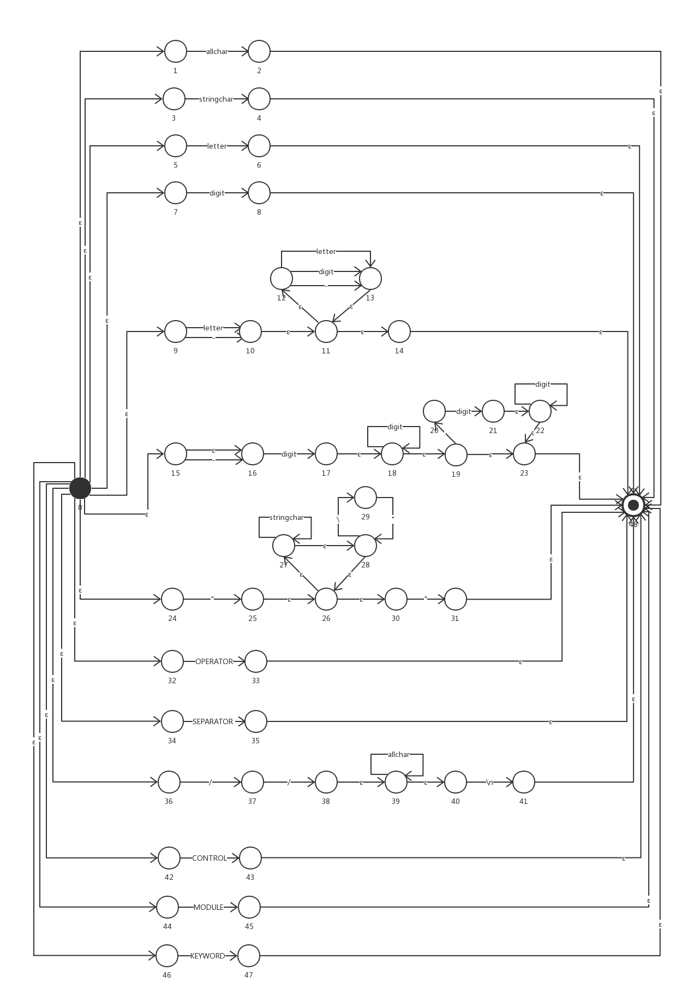

## Lex实验报告

学号：171250662

姓名：孙逸伦

### 0. 截图

#### 源文件目录截图

#### 资源文件截图

#### 输入文件/流内容截图

#### 输出token截图

### 1. 词法和语法定义

临时起意设计了一门新语言，姑且称之为Simple Words。

#### 1.1. 设计理念

尽可能简单的同时支持模块化。这门语言应当同时支持面向过程和基于对象（通过模块）。未来可能会增加对函数式的支持，至少也要把函数当成一等公民；但这次就算了，还没想好怎么弄。

这门语言不包含指针和位运算。我认为位运算的可读性较差，使用内置的函数代替。默认基本类型传值，模块传引用；提供深拷贝的内置函数。

在实践中我发现，容易出现过大的单个模块，导致可读性和可维护性下降，所以从语言层面进行限制，强制要求每个文件整体作为一个模块。

不强制要求main函数，从当前文件开始执行，由使用者自行决定调用顺序。

#### 1.2. 词法和语法

语言的关键字应该包括：控制结构（顺序、循环、分支）、基本类型、操作符、分隔符。

标识符由用户自定义，由字母、数字和下划线组成，以字母或下划线开头，且不能与关键字冲突。

所以，我们需要的控制结构关键字：if | else | while | break | continue | return。

为了支持模块化，我们需要的关键字：import | export。默认访问权限是模块内的，可以通过export对外暴露接口。可以通过.获取模块里export的内容；本来打算用`->`的，但感觉上`.`更符合使用习惯，而且更简单，更符合设计初衷。

没有继承机制，通过对象间的委托进行交互。

因为并没有类这个概念，没有实例化，也就不需要构造函数。

语言的基本类型：数字、字符串、∅（包括未定义undefined和空值null，都可以用∅来概括；布尔值可以看作0和非0）。其中，基本类型应该包括字面量。所以，我们需要的类型有：number | string | void。其中，number应该包括负数和浮点数，但不打算使用科学计数法；字符串由""包裹，如果字符串中出现"，需要进行转义。

操作符应该包括：算术运算符、比较运算符、取值运算符、转义运算符

所以，我们需要的关键字：operator -> + | - | * | / | ( | ) | < | > | <= | >= | == | != | = | [ | ] | . | \

分隔符应该包括：separator -> ; | { | }。不支持,分隔符。

只支持单行注释//，因为个人不太喜欢多行注释，并且在实践中感觉多行注释也没有那么大的作用。同时，字符串的优先级高于注释，也就是说，"//comment"会被视作一个完整的字符串，而不是一个未封闭的引号和一个单行注释。

#### 1.3. 语言示例

基本包含了语言的特性。

```typescript
// Test.sw
// OS.sw contains a function print
import OS;

// properties
number array[10];
Test next = void;

// methods
export void say_hello(){
    number i = 0;
    while(i < 3){
        if(i == 1){
            os->print(get_msg());
            array[i] = i;
            continue;
        } else {
            os->print(add(2, 1.0));
            break;
        }
    }
    Test t;
    next = t;
}

number add(number a, number b){
    return a + b;
}

string get_msg(){
    return "Hello World!";
}
```

### 2. 步骤简介

基于FA的解决方案（硬编码）

1. 预先定义正规表达式REs
2. 采用自顶向下的方法将REs转化成NFAs
3. 合并为一个单独的NFA
4. 转换成DFA
5. 化简为DFAo
6. 基于DFAo编写程序

### 3. 具体实现

#### 3.1. 预先定义正规表达式REs

```
// 即键盘上出现的可打印的字符，(space)表示空格。暂不考虑其他字符。
allchar -> stringchar | "

// 即allchar中去掉"（双引号）。
stringchar -> letter| digit | ! | @ | # | $ | % | ^ | & | * | ( | ) | _ | + | - | = | ` | ~ | { | } | [ | ] | : | ; | ' | , | . | < | > | ? | / | \ | \\| | (space)

letter -> A | B | C | D | E | F | G | H | I | J | K | L | M | N | O | P | Q | R | S | T | U | V | W | X | Y | Z | a | b | c | d | e | f | g | h | i | j | k | l | m | n | o | p | q | r | s | t | u | v | w | x | y | z

digit -> 0 | 1 | 2 | 3 | 4 | 5 | 6 | 7 | 8 | 9

ID -> (letter | _) (letter | digit | _)* 

NUMBER -> (- | ε)digit digit* (.digit digit* | ε)

STRING -> "((stringchar)*(\")*)*"

OPERATOR -> + | - | * | / | ( | ) | < | > | <= | >= | == | != | = | [ | ] | -> | \

SEPARATOR -> ; | { | }

CONTROL -> if | else | while | break | continue | return

COMMENT -> // allchar* \n

MODULE -> import | export

KEYWORD -> number | string | void | CONTROL | MODULE
```

#### 3.2. 采用自顶向下的方法将REs转化成NFAs


#### 3.3. 合并为一个单独的NFA



#### 3.4. 转换成DFA

##### 3.4.1. 转换表


可以看出这张表相当稀疏。

#### 3.5. 化简为DFAo

##### 3.5.1. 等价类划分


##### 3.5.2. 构造DFAo


#### 3.6. 基于DFAo编写程序

参见附件和截图，在此不再赘述。

### 4. 错误处理


### 5. 遇到的问题

NFAs数量相当大，化简起来非常耗时。

“越早发现和修复问题，成本越低”，在转化DFAo时发现错误可能意味着从NFA到分类都要进行修改，不啻于推倒重来。因为中途发现I16出现了错误，为了避免出现更大的错误，直接采用了类似于数据库对自增键的删除方案，删除后在最后一个序号的基础上增加，所以DFA中没有I16。

### 6. 个人感受

自己设计的语言估计会是贻笑大方了。

因为时间不够，来不及写一个Lex，实在遗憾。


